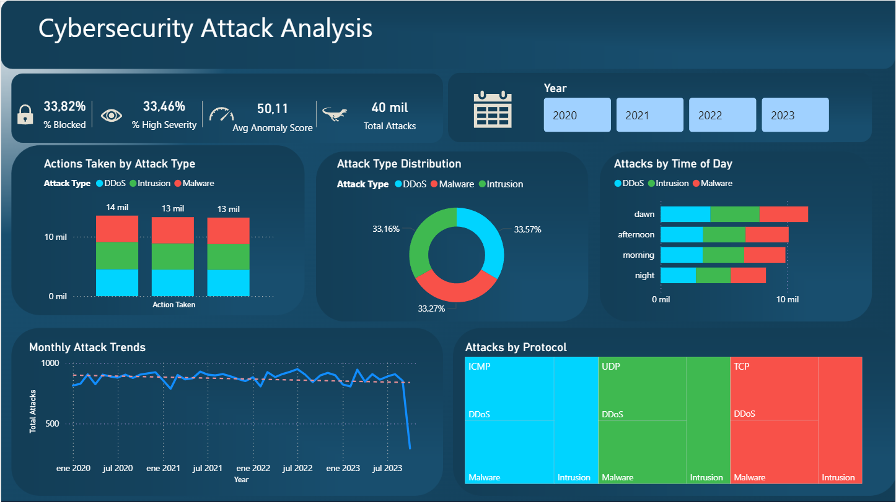

# Cybersecurity Attack Analysis

End-to-end data analysis project using Python and Power BI to explore cybersecurity attack patterns across a dataset of 40,000 records.

---

## Project Structure

```
Proyecto_cyberseguridad/
│
├── data/
│   └── cybersecurity_attacks.csv       # Raw dataset
│
├── notebooks/
│   ├── cargar_sqlite.ipynb             # Load raw data into SQLite
│   └── eda.ipynb                       # Exploratory data analysis & cleaning
│
├── script/
│   └── db_script.py                    # ETL pipeline script
│
├── output/
│   ├── cybersecurity_clean.csv         # Cleaned dataset
│   └── cybersecurity_clean.db         # SQLite database
│
├── powerbi/
│   └── visualizacion.pbix              # Power BI dashboard
│
└── README.md
```

---

##  Tools & Technologies

- **Python** → Data cleaning, transformation and EDA
- **Pandas / NumPy** → Data manipulation
- **Seaborn / Matplotlib** → Exploratory visualizations
- **SQLAlchemy / SQLite** → Data storage
- **Power BI** → Interactive dashboard

---

##  ETL Pipeline

### 1. Extraction
- Loaded raw CSV with 40,000 records and 25+ columns

### 2. Transformation
- Filled null values in: `Malware Indicators`, `Alerts/Warnings`, `Proxy Information`, `Firewall Logs`, `IDS/IPS Alerts`
- Converted `Timestamp` to datetime
- Created new features:
  - `Year`, `Month`, `Day`, `Hour`
  - `DayOfWeekName`, `DayOfWeekNumber`
  - `time_of_day` → dawn / morning / afternoon / night
  - `year_month` → timeline grouping
  - `risk_category` → low / medium / high based on Anomaly Score

### 3. Load
- Exported cleaned data to SQLite database and CSV

---

##  Power BI Dashboard

### Page 1 - Overview

- KPIs: % Blocked, % High Severity, Avg Anomaly Score, Total Attacks
- Attack Type Distribution
- Actions Taken by Attack Type
- Attacks by Time of Day
- Monthly Attack Trends
- Attacks by Protocol

### Page 2 - Temporal Analysis

- Hourly Attack Patterns
- Monthly Attacks by Type
- Attacks by Time of Day and Severity
- Peak Hour: 13:00
- Busiest Day: Tuesday

---

##  Key Findings

- Attack types (DDoS, Malware, Intrusion) are evenly distributed (~33% each)
- Peak attack hour is **1 PM**
- **Tuesday** registers the highest number of attacks
- Attack volume remained stable from 2020 to mid-2023

---

## Dataset

- Source: [Kaggle - Cybersecurity Attacks Dataset](https://www.kaggle.com/datasets/laodeikhwanuluzlah/cybersecurity-attacks-dataset)
- Records: 40,000
- Period: 2020 - 2023

---

## Author

David Fernando Solano Garcia - Data Analyst & Industrial Engineer

[LinkedIn](https://www.linkedin.com/in/david-fernando-solano-garcia-840230348)

Última actualización de prueba.